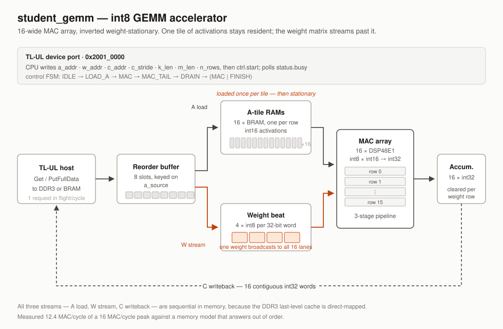

RISC-V ViT Accelerator
======================

Depth-Anything V2 Small — a vision transformer that turns a photo into a depth
map — running on a CV32E40P RISC-V core on an Artix-7 FPGA, with a custom int8
GEMM accelerator for the matrix multiplications.

No operating system, no inference framework, no floating-point unit. The
network is a hand-written freestanding C engine; the matmuls are hardware.

Results
-------

| | |
|---|---|
| Accuracy vs. PyTorch reference | correlation **0.99984** |
| GEMM throughput | **12.4 MAC/cycle** of a 16 MAC/cycle peak (78%) |
| Speed-up on the matmul | **~75x** over the CPU kernel |
| Timing | met, WNS **+0.268 ns** at 50 MHz |
| Resources | LUT 12.7%, BRAM 23.0%, DSP 3.1% of an XC7A200T |

One frame at 126x126 is 2.412 G MAC and 5.273 M requantised elements. The
accelerator takes the multiply-accumulate work from ~290 s to ~4 s, which makes
the element-wise CPU work (requantisation, LayerNorm, GELU) and the 25 MB of
weights crossing DDR3 the new limits.

How it works
------------

**Software** (`src/sw/project/`) — ~2000 lines of C, freestanding. Weights are
int8 with a per-output-channel scale, activations int16 at 14 bits, and each
scale is pre-baked into a gemmlowp-style `(multiplier, shift)` pair so the
device never divides. Memory comes from a bump allocator over a DDR3 arena;
`sqrt`, `exp` and `erf` are hand-written because the build links `-nostdlib`.

Every matmul in the network — patch embedding, attention projections, MLPs,
the DPT head — funnels through one function, `dav2_qgemm()`. That single choke
point is why the accelerator needed exactly one attachment point.

**Hardware** (`src/rtl/student/student_gemm.sv`) — a 16-wide
int8xint16 -> int32 MAC array with its own TL-UL host port. The dataflow is
inverted weight-stationary: a tile of 16 activation rows loads into 16 private
BRAMs, then the weight matrix streams past as one contiguous byte stream, each
weight broadcasting to all 16 multipliers. All three streams are sequential,
because the DDR3 last-level cache is direct-mapped. An 8-slot reorder buffer
keyed on `a_source` tolerates out-of-order responses, and the accumulator
layout is `[m][n]` so writeback stays contiguous.

The software kernel never leaves: `dav2_accel_qgemm()` declines any shape the
hardware cannot take, and a boot-time cross-check disables the block on
mismatch rather than producing wrong answers.

Layout
------

    src/rtl/student/student_gemm.sv   the accelerator
    src/rtl/student/student.sv        bus integration (TL-UL sockets)
    src/design/reggen/                register map, and the software contract
    src/sw/project/                   the inference engine and its driver
    src/sw/project/host/              native build, for verification
    src/sw/project/tools/             weight export, NumPy reference, board runner
    src/tb/                           unit and socket-level testbenches
    report.md                         engineering record and design rationale
    report_how_it_runs.md             plain-language walkthrough

Building
--------

    flow sw_project build                      # RISC-V program
    flow student_gemm_tb sim_rtl_xsim          # accelerator unit tests
    flow systb_project sim_rtl_xsim_batch      # full system simulation
    flow rvlab_fpga_top syn pnr bitstream      # bitstream

The same engine sources also build natively, which is the fast way to check a
change against the PyTorch reference:

    make -C src/sw/project/host run

Status
------

Verified: the engine against PyTorch on a host; the kernels bit-exactly on the
CV32E40P in RTL simulation; the accelerator against a memory model that answers
out of order (1672 words, exact); hardware and software agreeing on the core at
boot; and a bitstream that closes timing.

Not yet done: no board run, and no DDR3-inclusive system simulation. Every
number above comes from simulation or static analysis.

Built on
--------

[tub-msc/rvlab](https://github.com/tub-msc/rvlab), the SoC + RISC-V Lab platform
from the [Mixed Signal Circuit Design group](http://tu.berlin/msc) at TU Berlin.
The platform's own documentation is at
[rvlab.readthedocs.io](https://rvlab.readthedocs.io/en/latest/); setup
instructions are in `docs/tutorials/setup/index.rst`.

Third-party sources under `src/rtl/` (CV32E40P, the TL-UL fabric, OpenTitan
primitives) are unmodified.
