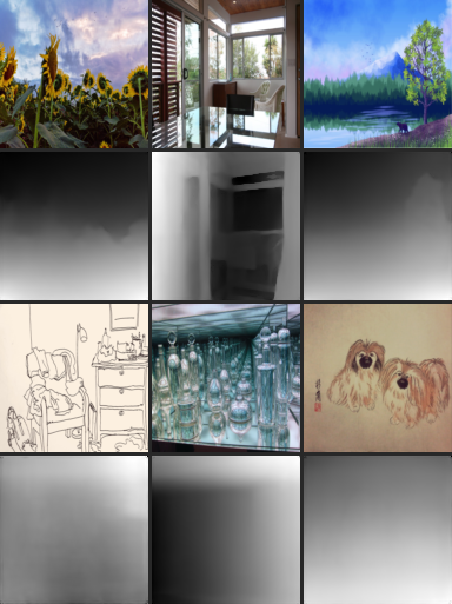
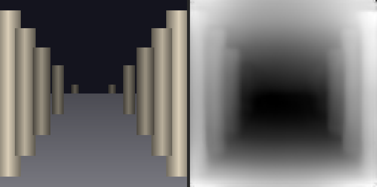
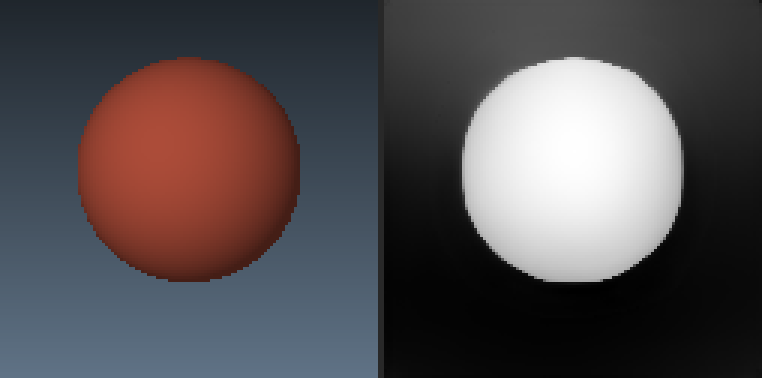

RISC-V ViT Accelerator
======================

Depth-Anything V2 Small — a vision transformer that turns a photo into a depth
map — running on a CV32E40P RISC-V core on an Artix-7 FPGA, with a custom int8
GEMM accelerator for the matrix multiplications.

No operating system, no inference framework, no floating-point unit. The
network is a hand-written freestanding C engine; the matmuls are hardware.

*Left: input. Middle: PyTorch reference. Right: the FPGA's output. Bright is
near.*

Results
-------

| | |
|---|---|
| FPGA output vs. the same C engine on a PC | **bit-exact**, 15876/15876 pixels, on every image tried |
| FPGA output vs. PyTorch reference | correlation **0.99987** |
| Frame time on the board | **14.2 s** (0.070 FPS) at 50 MHz — was 93.6 s before the speed-up work |
| Weights load (once per session) | ~66 s over JTAG; each image then 0.3 s in, 0.7 s out |
| Timing | met, WNS **+0.121 ns** at 50 MHz, 0 failing endpoints |
| Resources | LUT 14.8 %, BRAM 36.9 %, DSP 10.4 % of an XC7A200T |

One frame at 126×126 is 2.4 G multiply-accumulates. The accelerator does all
of them — the four GEMMs of every transformer block, the convolutions, and
both matrix products inside attention — and also turns its int32 sums back
into int16 activations. What remains on the CPU is LayerNorm, softmax, GELU,
the residual adds and the convolution patch gathers; `docs/PERFORMANCE.md`
has the profile and the story of how 93.6 s became 14.2 s.

Six of the Depth-Anything example photographs, run through one weight load.
Input above, FPGA depth below; every one is bit-exact with the host build:

Top row: a sunflower field, a sunlit interior, a lake painting. Bottom row:
a line drawing, glass bottles in a mirror, an ink painting of two dogs. The
first three are what the model is for and it handles them well — the interior
in particular, read as a tunnel with the far view through the door darkest.
The last three were chosen to be hard. The line drawing, with no shading to
work from, is only partly resolved; the bottles defeat it the way transparency
and reflection defeat every monocular depth model; the ink dogs contain almost
no depth and the output says so. A bit-exact port reproduces the model's
limitations as faithfully as its strengths.

Synthetic scenes, input left and depth right:

How it works
------------

Every computation of one frame, in order — 35 numbered steps with the exact
tensors each reads and writes, where they live, and what runs in parallel
(`docs/DATAFLOW.md` §3 walks through it; the same section has the frame as
a process in four lanes):

**Software** (`src/sw/project/`) — ~2000 lines of C, freestanding. Weights are
int8 with a per-output-channel scale, activations int16 at 14 bits, and each
scale is pre-baked into a gemmlowp-style `(multiplier, shift)` pair so the
device never divides. Memory comes from a bump allocator over a DDR3 arena;
`sqrt`, `exp` and `erf` are hand-written because the build links `-nostdlib`.

Every matmul in the network — patch embedding, attention projections, MLPs,
the DPT head — funnels through one function, `dav2_qgemm()`. That single choke
point is why the accelerator needed exactly one attachment point.

**Hardware** (`src/rtl/student/student_gemm.sv`) — a 64-wide
int8×int16 → int32 MAC array with its own TL-UL host port and eight reads in
flight. A tile of 64 activation rows loads into on-chip BRAM once, then the
weight matrix streams past, each weight broadcasting to all 64 multipliers.
Rows of either operand may be read at a stride, so a job can take a column
slice of a wider matrix — that is how attention's Q·Kᵀ reads a head out of
the qkv tensor, and how a reduction longer than the tile is split. While it
drains a result row it reports the row's max and min, and a second job type
requantises a whole int32 result matrix to int16 with per-row scale and
bias, transposing it on the way. Any read the platform's cache fails to
answer is re-issued.

The software kernel never leaves: `dav2_accel_qgemm()` declines any shape the
hardware cannot take, and a boot-time cross-check disables the block on
mismatch rather than producing wrong answers.

What it took
------------

The accelerator was right early. What stood between it and a correct depth
map were three defects in the platform's DDR3 path — a request-accept
handshake taken from the wrong module, a cache that wrote back stale data
when a line was evicted the cycle after it was written, and a prefetcher that
returned the wrong address's data under collisions. Finding them needed a
hardware watchdog register (because a CPU wedged on a bus access cannot be
halted by a debugger) and a testbench driver rewritten to issue requests
back-to-back like a real CPU. The full account, including the wrong turns, is
in `docs/DEBUGGING.md`.

Documentation
-------------

    docs/ARCHITECTURE.md   the SoC, the memory map, the accelerator, the DDR3 path — with diagrams
    docs/DATAFLOW.md       timing diagrams and the complete numbered flow of one frame (who does what, on which memory, what overlaps)
    docs/DEBUGGING.md      every defect: symptom, wrong theories, instrument, fix, verification
    docs/DDR3_FOR_BEGINNERS.md  the three memory bugs told from scratch, no DDR3 knowledge assumed
    docs/LESSONS.md        portable rules for the next project
    docs/HANDOFF.md        current state, what is bypassed, what is not done
    docs/PERFORMANCE.md    the speed-up from 93.6 s to 14.2 s: profile, each step, what is left
    CLAUDE.md              build, simulate, and run commands

What each file does
-------------------

Everything below was written for this project. Files not listed here belong
to the RVLab platform or to third parties and were not touched, with the two
exceptions marked *(platform file, fixed)*.

### The hardware — `src/rtl/`

| File | What it is, in plain words |
|---|---|
| `student/student_gemm.sv` | **The accelerator.** 64 multipliers that compute a matrix product against 64 rows of activations held on-chip while the weights stream past once; it also reports the per-row range of its results and, as a second job type, requantises them back to int16. The CPU programs it through registers (`student_gemm.hjson`). |
| `student/student.sv` | **Wiring.** Connects the accelerator (and a small DMA block) to the system bus, both as something the CPU can program and as something that can read and write memory on its own. |
| `student/student_tl_watch.sv` | **A debugging register.** Sits beside the memory port and remembers the last request that never got an answer — which address, from which block, for how long. Readable over the debug cable even when the CPU is frozen and cannot be stopped. This is what found the hang. |
| `student/student_tl_rsp_hold.sv` | **A small buffer** that holds a memory reply until the receiver is ready for it, working around a cache that would otherwise drop it. Currently switched off — the real cause was fixed elsewhere — but kept and tested. |
| `ddr3/rvlab_tlul_ddr.sv` *(platform file, fixed)* | The top of the memory path. Two fixes live here: the "ready" signal that was taken from the wrong block so requests vanished, and a switch that bypasses the faulty prefetcher. |
| `ddr3/rvlab_ddr_block_cache.sv` *(platform file, fixed)* | The 16 kB cache in front of DDR3. One-line fix: when a line was evicted the very cycle after being written, it wrote the *old* contents back to memory and lost the write. |

### Register maps — `src/design/reggen/`

| File | What it is |
|---|---|
| `student_gemm.hjson` | Lists the accelerator's control registers — the addresses of A, W and C, the matrix sizes, start, status, and four debug counters. A generator turns this into both the hardware register block and the C header, so software and hardware always agree. |
| `ddr_ctrl.hjson` *(extended)* | The DDR3 status registers, plus the two watchdog registers above. |

### The program that runs on the RISC-V — `src/sw/project/`

Plain C, no operating system, no floating-point hardware. The same source
also compiles on a PC (see "the oracle" below), which is how it is checked.

| File | What it does |
|---|---|
| `main.c` | **Start here.** Sets up memory, waits for the host to say the weights are loaded, runs one inference, prints the depth map as text for the host to collect, and reports the time taken. |
| `dav2_engine.c` | **The network itself**, layer by layer: cut the image into patches, run the 12 transformer blocks, run the decoder that turns features back into a depth map. Reads like the paper's diagram. |
| `dav2_ops.c` | **The maths kernels** the engine calls: matrix multiply (which hands off to the accelerator), LayerNorm, softmax, GELU, convolution, and the requantisation that turns each 32-bit result back into 16-bit. Also the memory arena. |
| `dav2_accel.c` / `.h` | **The accelerator driver.** Programs the registers, splits a big matrix into 16-row tiles, waits for each to finish with a timeout, and falls back to the CPU kernel if the hardware declines a shape. Includes a boot-time self-check that compares hardware against software. |
| `dav2_blob.c` | **Reads the weight file.** The weights arrive as one 25 MB "blob" with a directory at the front; this looks tensors up by name. |
| `dav2_mathf.c` / `.h` | Hand-written `sqrt`, `exp` and `erf`, because the program links without a standard library. |
| `dav2_selftest.c` | A small deterministic test that prints a checksum. The same checksum must appear on the PC and on the board, proving the two builds compute identically. |
| `dav2.h` | Shared types: what a tensor is, what a quantised weight matrix is, the blob format. |
| `dav2_blob_config.h` | Generated by the exporter: input size, patch grid, token count. |

### The oracle — `src/sw/project/host/`

| File | What it does |
|---|---|
| `host_main.c` | Compiles the *same* engine for the PC and runs it in about four seconds on a blob plus a `.dav2img` — the identical bytes the board receives. Its output is the reference every board result must match bit for bit, and it does, on every image tried. |
| `host_stubs.c`, `selftest_main.c`, `Makefile` | Glue: a stub for the board-only progress print, the self-test entry point, and the build. |

### Python tools — `src/sw/project/tools/`

These run on the PC, not the board.

| File | What it does |
|---|---|
| `export_dav2.py` | **Makes the weight blob.** Loads the PyTorch model, quantises every weight to int8 with a per-row scale, preprocesses an input photo, and writes it all into one file with a directory. Needs `torch`, `numpy`, `pillow`. |
| `dav2_common.py` | Shared helpers for the tools: loading the model, resizing and normalising an image, and running the PyTorch float reference used as ground truth. |
| `dav2_numpy.py` | **The blueprint.** A NumPy re-implementation of the whole network in which every operation has a one-to-one twin in `dav2_ops.c` / `dav2_engine.c`. The C was written from this, and checked against it. |
| `dav2_run_fpga.py` | **The board runner.** Starts the debugger, resets the CPU, loads the program, streams the 25 MB blob into DDR3 over JTAG once (~1 min), then serves images: each `--image`, `--synth` or `--dav2img` is preprocessed, sent as 95 kB (~0.26 s), run, and saved as `.npy` with the exact bytes the board saw beside it. If a run stalls it reads the watchdog register and tries to halt the CPU so you see *where*. |
| `dav2_image.py` | **Prepares a picture for the board.** Resize, ImageNet normalisation, quantisation — byte-identical to the exporter — from any picture file, a built-in scene, or a raw array, into the `.dav2img` format the engine and the host oracle both read. Can also render a `.dav2img` back to PNG. |
| `dav2_patch_image.py` | **Synthetic test scenes.** Eight generated pictures (gradient, checker, sphere, corridor, road, spheres, stairs, pillars) that `dav2_image.py --synth` draws on. Its original job — rewriting the image inside a blob — is obsolete now that images travel separately. |

### Testbenches — `src/tb/`

Simulations that check the hardware without a board. Each is a small program
that drives the block under test and compares what comes out.

| File | What it checks |
|---|---|
| `student_gemm_tb.sv` | The accelerator alone, against a perfect memory that always answers. Many shapes, every output word compared. |
| `student_gemm_soc_tb.sv` | The accelerator behind the real bus arbiter, so responses can arrive out of order. |
| `student_gemm_ddr_tb.sv` | The accelerator against a memory with DDR3-like delays. |
| `student_gemm_ddrpath_tb.sv` | The accelerator against the **real cache** — the closest simulation to the board. |
| `student_gemm_droprsp_tb.sv` | Deliberately drops one memory reply and confirms the accelerator's retry timer recovers. Fails without the retry, passes with it. |
| `rvlab_ddr_dready_tb.sv` | Shows the cache drops a reply if the receiver is busy for one cycle — and that the hold buffer prevents it. |
| `rvlab_ddr_alias_tb.sv` | Two memory regions that collide in the cache, driven back-to-back like a real CPU. Found the prefetcher fault and the write-back fault; both fixes were proven here first. |
| `ddr3_blk_model.sv` | A **stand-in for the DDR3 chip and controller** that answers in a few cycles instead of needing a 90-minute calibration. Can preload the weight blob and place the simulation start token. Makes whole-SoC simulation practical. |
| `tlul_test_mem.sv`, `tlul_test_host.sv` *(extended)* | Shared test helpers: a memory that can be told to drop the Nth reply, and a bus driver with a quiet mode. |

### Build flow — `flow/`

| File | What changed |
|---|---|
| `flow/__init__.py` | Registers the new testbenches so `flow <name>.sim_rtl_xsim` works. |
| `flow/system_tb.py` | Adds `sim_ddrmodel_xsim`: the whole SoC with `ddr3_blk_model` in place of real DDR3. |
| `flow/tools/xsim.py` | Fixed a bug that merged all simulator arguments into one, silently losing every argument but the first. |

Building and running
--------------------

    source .venv/bin/activate
    flow sw_project.build                       # RISC-V program
    flow student_gemm_tb.sim_rtl_xsim           # accelerator unit test
    flow rvlab_ddr_alias_tb.sim_rtl_xsim        # the cache and prefetcher tests
    flow rvlab_fpga_top.bitstream               # syn + pnr + bitstream
    flow rvlab_fpga_top.program                 # load onto the board
    python -u src/sw/project/tools/dav2_run_fpga.py --image photo.jpg --image other.jpg

The weights load once (~66 s); each `--image` after that costs a quarter of a
second of transfer and ~94 s of inference. `--synth NAME` runs a built-in
scene; with no image given, the demo photograph runs.

The same engine sources build natively, which is the fast way to check any
change and the reference every board result must match bit for bit:

    make -C src/sw/project/host
    ./src/sw/project/host/dav2_host build/dav2/dav2_weights.bin out.bin

`src/sw/project/tools/dav2_image.py` does the preprocessing — resize,
ImageNet normalisation, quantisation — byte-identically to the exporter, and
can render a `.dav2img` back to a PNG to see exactly what the board saw.

Built on
--------

[tub-msc/rvlab](https://github.com/tub-msc/rvlab), the SoC + RISC-V Lab platform
from the [Mixed Signal Circuit Design group](http://tu.berlin/msc) at TU Berlin.
The platform's own documentation is at
[rvlab.readthedocs.io](https://rvlab.readthedocs.io/en/latest/); setup
instructions are in `docs/tutorials/setup/index.rst`.

Third-party sources under `src/rtl/` (CV32E40P, the TL-UL fabric, OpenTitan
primitives, the UberDDR3 controller) are unmodified. Two RVLab platform files
in `src/rtl/ddr3/` carry fixes, each documented at the change.
