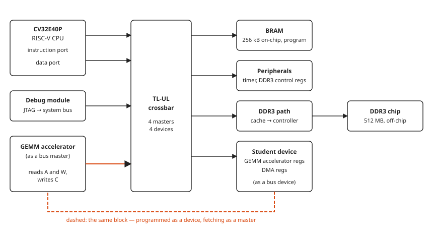
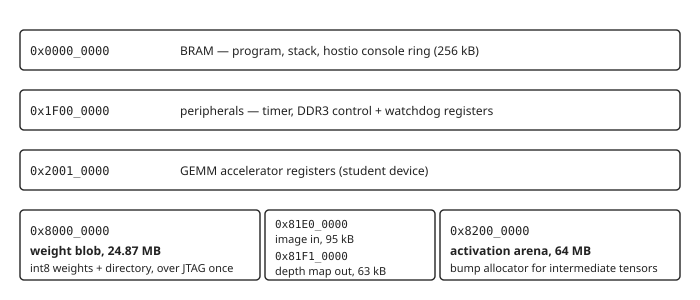
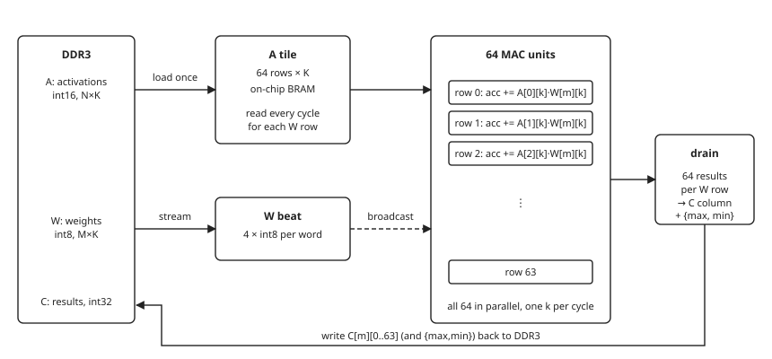
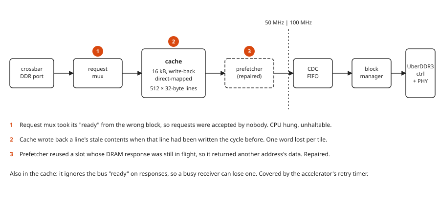

# System architecture

How the pieces of this design fit together. Written for an engineer who has
not seen the project before; every specialised term is explained the first
time it is used.

The goal of the design is to run **Depth-Anything V2 Small** — a neural
network that takes a photograph and estimates how far away every pixel is —
on a small RISC-V processor inside an FPGA, with the heavy matrix arithmetic
offloaded to a custom hardware block.

---

## 1. The board and the chip

The hardware is a Digilent Nexys Video board carrying a Xilinx **Artix-7
XC7A200T** FPGA and a 512 MB DDR3 memory chip.

An *FPGA* (field-programmable gate array) is a chip whose logic is not fixed
at manufacture: a "bitstream" loaded at power-on wires its internal resources
into whatever circuit you describe. Everything in this document below the
DDR3 chip — the processor, the bus, the accelerator, the memory controller —
is built from that fabric. Nothing here is a fixed silicon CPU.

The design runs at **50 MHz**. That sounds slow next to a desktop CPU, and it
is: it is the clock at which a soft processor synthesised into this fabric
closes timing with margin. The whole SoC uses 14.8 % of the chip's logic,
36.9 % of its block RAM (mostly the accelerator's 256 kB tile) and 10.4 % of
its DSP multipliers (77 of 740); timing is met with 0.12 ns to spare.

---

## 2. The SoC at a glance

An *SoC* (system on chip) is the collection of processor, memories,
peripherals and interconnect that together make a computer. Here it is:

*Everything talks through one crossbar. The accelerator appears twice: as a **device** the CPU programs through registers, and as a **master** that fetches its own operands from DDR3 — the orange arrow and dashed link. That double role is why bus bugs affected it and the CPU differently.*

**Bus masters** — the things that start transactions:

- **CV32E40P** — the RISC-V processor. RV32IMC: 32-bit, integer, multiply,
  compressed instructions. No floating-point unit, so a `float` in the C
  code would be emulated in software. The program therefore uses no floats
  (`dav2_xf.h`). It has two bus ports, one for fetching
  instructions and one for data.
- **Debug module** — reachable over JTAG (a serial debug link from the host
  PC). It can halt the CPU and read its registers, and it can also read and
  write memory directly on the bus without the CPU's involvement. That second
  ability turned out to be the most valuable debugging tool in the project.
- **GEMM accelerator** — the custom hardware block, which fetches its own
  operands with up to eight reads in flight. It has two job types: a matrix
  product, and the requantisation of a product's int32 result to int16 (§4).

**Bus devices** — the things that respond:

- **BRAM** — 256 kB of on-chip memory. Holds the program, its stack, and a
  40 kB scratch buffer the C kernels use for anything reused many times
  inside one operator (an attention head's q and k, LayerNorm's per-channel
  tables). Single-cycle from the CPU's point of view, unlike DDR3.
- **Peripherals** — a timer and the DDR3 controller's status registers.
- **DDR3 path** — the cache and controller in front of the external memory.
  Holds the 25 MB of neural-network weights and all the working data.
- **Student device** — the register interface of the accelerator and a DMA
  block.

### The bus: TL-UL

The interconnect is **TileLink Uncached Lightweight (TL-UL)**, a simple
request/response bus from the OpenTitan project. Each transaction is a
*request* on the "A channel" (address, opcode, data) answered by exactly one
*response* on the "D channel". Each channel has a `valid` from the sender and
a `ready` from the receiver; a transfer happens only in a cycle where both are
high. That two-signal handshake is the single most important rule in this
design, and two of the three bugs found were violations of it.

---

## 3. Memory map

*The blob and the arena are 32 MB apart in DDR3. That distance matters: the cache in front of DDR3 is indexed by address bits [13:5], so both regions map onto the same 512 cache lines and constantly evict each other.*

Four regions in DDR3 do all the work:

- **The weight blob** at `0x8000_0000`. A single file produced by
  `export_dav2.py` containing every tensor the network needs — weights,
  biases, scales, all as integers — plus a directory at the front so the C code can find them
  by name. It is loaded once over JTAG (about a minute).
- **The input image** at `0x81E0_0000`, in the gap between blob and arena:
  126×126×3 int16 pixels then one float32 scale, 95 kB. The program never
  computes with that float: it converts its bits to an integer pair. It is *not* part of the
  blob, so a new picture is a quarter-second transfer rather than a new
  minute-long weight load. The program serves frames: it waits for the host
  to write an image here and raise a flag, runs it, publishes the result,
  and waits for the next.
- **The depth map** at `0x81F1_0000`, also in the gap: the scale as two
  int32 (m, sh), then 126×126 int16 values, 32 kB. The depth is
  q · m · 2^−sh. The host reads it straight off the bus over JTAG and
  converts it to float32 (it used to be printed as hex text through the
  console, ~30 s).
- **The activation arena** at `0x8200_0000`. Working memory for the tensors
  the network produces as it runs. A *bump allocator* hands out space by
  advancing a pointer and can only free it all at once, which suits a
  network whose memory needs are known and layered.

---

## 4. The GEMM accelerator

*GEMM* means general matrix multiply. Every matrix multiplication in the
network — and a transformer is almost nothing but matrix multiplications —
funnels through one C function, `dav2_qgemm()`. That function hands the work
to the accelerator.

The block computes `C = A × Wᵀ` where `A` is an int16 activation matrix
(N rows × K), `W` is an int8 weight matrix (M rows × K), and `C` is the int32
result (M × N). *int8/int16/int32* are 8-, 16- and 32-bit integers; the
network was quantised so all the arithmetic is integer, because the CPU has
no floating-point hardware.

*Reuse is the whole idea: 128 rows of A are loaded once and held on-chip, then every weight row streams past all 128 at once. Each int8 weight is multiplied against 128 activations the cycle it arrives, so the weight — the dominant memory traffic — crosses the bus once per tile: once for the encoder's 82 tokens.*

The execution of one *GEMM job* (one 128-row tile of A against all of W):

1. **Load** the A tile — up to 128 rows × K int16 — from DDR3 into on-chip
   BRAM (512 kB, 128 block RAMs). Rows may lie `A_STRIDE` bytes apart, so
   the tile can be a column slice of a wider matrix.
2. **Stream** W: each 32-bit word carries four int8 weights. As each arrives
   it is broadcast to all 128 MAC units, each of which multiplies it against
   its own row of A and accumulates. W rows may also be strided.
3. **Drain**: when a weight row `m` is finished, the accumulated results
   are written to DDR3 as column `m` of C. With `S_ADDR` set, the row's max
   and min go out after them — the range the requantisation needs, so the
   CPU never reads C back for it.
4. Repeat 2–3 for every row of W. Then the CPU starts the next tile.

A matrix with N=82 rows is one job; the DPT head's 15 876-pixel convolutions are 125.
A reduction longer than the tile RAM (K = 3456 in the 384-channel 3×3
convolutions, against KMAX = 2048) is run as two column-slice jobs whose
partial sums the CPU adds.

The block reads with **eight requests in flight** through a reorder buffer
indexed by the bus source ID, which is what brought it from 8.3 to 3.2
cycles per beat. It measures 3.2 because a 32-byte cache line is filled from
DRAM once per eight beats. The prefetcher (§5), repaired and back in the path, fetches the next line ahead; its effect on the board is not yet measured.

### The requantisation job

Every GEMM's int32 result has to become int16 activations again:
`out[n][m] = sat14((C[m][n]·mult[m] + 2^(s−1)) >> s + bias[m])`, with a
multiplier, shift and bias per weight row chosen by the CPU from the row
ranges above. That used to be ~70 CPU cycles per element — a third of the
frame — and is now the block's second job type (`CTRL.requant`):

1. Read the per-row `{mult, shift, bias}` table (`P_ADDR`) into a small
   parameter RAM.
2. Read a chunk of C — up to 1024 rows × 128 columns — into the A-tile RAM
   **transposed**: RAM row = n, word = m. This is what turns the m-major
   result into n-major output for free.
3. Stream out: one element per cycle through the pipeline (multiply in
   DSPs, round, shift, add bias, saturate), two int16 packed per word, into
   a 32-entry FIFO that the write engine drains.

The job has an optional **epilogue**, so the operation that usually follows
a GEMM doesn't need a pass of its own:

- **`CTRL.add`** — a residual connection. The job also loads the residual
  chunk `x` (`X_ADDR`, laid out like the output) into the upper half of the
  tile RAM, then writes
  `sat14(((x·ADD_MULT_X + r) >> sx) + ((h·ADD_MULT_H + r) >> sh))`, where
  *h* is the plain requantised value. That is exactly what the CPU's
  `dav2_add` computes. The RAM has one read port, so the pipeline reads the
  accumulator in one cycle and the residual in the next. The job is limited
  by the bus anyway (~6 cycles per element), so this costs nothing. A chunk
  is at most 512 rows in this mode.
- **`CTRL.relu`** — clamp the output at 0.
- **`CTRL.lut`** — map the final value v through a lookup table,
  out = LUT[v + 8192]. The table has one int16 per possible value
  (16384 entries, 8192 words in 8 BRAM36). With **`CTRL.lut_load`** the
  job first reads it from `LUT_ADDR`; later jobs reuse it. The engine
  loads the GELU table for fc1's result here, so the GELU pass on the CPU
  disappears. It is one pipeline stage (q12) after saturation and ReLU.

A second input format serves LayerNorm:

- **`CTRL.a16`** — the input is int16 instead of int32, two per word.
  The loader writes each word into two tile rows, and the output stage
  takes the low or the high half by the column's parity. LayerNorm runs
  as two such jobs: z = (x − mean)·r at a common 14-bit scale with the
  tokens as rows, then z·γ + β with the channels as rows. The CPU keeps
  the row statistics and the channel ranges.

A GEMM job can also take **int16 weights** (**`CTRL.w16`**), two per word:
the DSP multipliers are 25 × 18 bits, so a 16 × 16 product costs nothing
extra. Attention uses it for q (scores) and v (context), which are int16
activations and were split into two int8 halves before.

With **`CTRL.ostats`** a requantisation job also writes each output row's
largest and smallest value to `S_ADDR` after the output. The residual
updates use it for the tokens' ranges and LayerNorm's first job for the
channels' ranges, so LayerNorm needs no compare per value.

`CAPS` bits 24 to 27 announce the lookup table, the int16 input, the int16
weights and the row statistics. The
driver uses them only when the bit is set and its boot self-test passes;
otherwise the same arithmetic runs on the CPU.

The add needs the output scale of *h* before any *h* exists. Per row,
requantisation is non-decreasing in the accumulator, so the row's largest
|h| is reached at its largest or smallest accumulator, which the drain
statistics already give. The CPU therefore computes the add's multipliers
exactly, and the fused result is bit-identical to requantise-then-add.

The arithmetic matches the C code to the bit; `student_gemm_tb` checks
every mode against a bit-level model, and the board is checked against the
host build.

The block has a register interface the CPU programs (addresses and strides
of A, W and C; K, M and the tile row count; `S_ADDR`, `P_ADDR`; a control
word with start and requant bits; status) and four debug registers that
expose internal counters. Peak is 128 multiply-accumulates per cycle; the
block is memory-bound, not compute-bound, so the tile width buys fewer
passes over the weights rather than more arithmetic per pass.

### Retry timer

The block also carries a **retry timer**: every outstanding read's address
is kept in its reorder-buffer slot, and if the oldest one gets no response
within 2048 cycles of bus silence it is re-issued. This exists because the
platform's cache can drop a response (§5); the accelerator could survive
that, the CPU could not. With eight reads in flight the board reports zero
retries per frame.

---

## 5. The DDR3 path — where the bugs lived

Between the crossbar and the memory chip sit four blocks. All three defects
fixed in this project were in this path, so it is worth seeing in full.

*The dashed vertical line is a clock-domain crossing: the controller runs at 100 MHz, the rest at 50 MHz. All three fixed defects (orange) sit on the 50 MHz side, in platform RTL rather than the accelerator.*

Terms used above:

- **Cache** — a small fast memory that keeps copies of recently used data so
  the next access is served locally instead of from slow DDR3.
- **Direct-mapped** — each address can live in exactly one cache line,
  chosen by address bits [13:5]. Two addresses that agree in those bits
  *collide*: bringing one in throws the other out.
- **Write-back** — writes go into the cache and are marked *dirty*; the
  updated line is only written to DDR3 later, when it is thrown out
  (*evicted*) to make room. This is efficient but means an
  "acknowledged" write is not yet in memory.
- **Prefetcher** — guesses which lines will be wanted next and fetches them
  early. Ours returns wrong data under collisions and is switched off.
- **CDC FIFO** — a queue that safely passes data between two clock domains.
- **Block manager** — converts the cache's 32-byte line requests into the
  controller's Wishbone bus transactions and tracks up to 16 in flight.
- **UberDDR3** — a third-party open-source DDR3 controller (formally
  verified upstream; no defect was found in it).

The cache's failure mode deserves one more sentence, because it was the last
and hardest to find. When the line being evicted was written on the
*immediately preceding* cycle, the cache read the line's contents from its
RAM before that write had landed there, and sent the old contents to DDR3.
It only ever happened on two back-to-back misses to the same cache line —
write one, evict it for the next — which is exactly what the accelerator's
last write of a tile followed by the next tile's first access produces.

---

## 6. How the pieces are exercised

| Level | What runs | Where the DDR3 is | Time |
|---|---|---|---|
| Host reference | the C engine natively on the PC | `malloc` | ~4 s |
| Host + accelerator emulator | the same engine with the real driver, programming a register-level C model of `student_gemm` (`host/accel_emu.c`); must match the host reference bit for bit | `mmap` below 4 GB | ~3 s |
| Module testbench | one RTL block against a behavioural memory (`student_gemm_tb`: GEMM shapes, strided operands, row statistics, the requantisation job against a bit-level model; `student_gemm_ddrpath_tb`: the same block through the real cache with eight reads in flight) | `ddr3_blk_model.sv` | seconds–minutes |
| System testbench | the whole SoC, no DDR3 | none | ~17 min for 4 M cycles |
| System + behavioural DDR3 | the whole SoC, cache and block manager real | `ddr3_blk_model.sv` | same rate |
| Full DDR3 simulation | everything including the JEDEC chip model | real | ~600× slower; avoid |
| Board | the bitstream on the FPGA | real | 14.2 s per frame |

The host reference is the *oracle*: the same C source compiled for the PC.
Because all the arithmetic is integer, including the scales
(`dav2_xf.h`), the board's output is required to be bit-identical
to it — and is, on every image tried. That equality was also the regression
test for the speed-up work: every change was checked against the previous
host output byte for byte (`PERFORMANCE.md`).

The emulator sits between the two. It runs the driver's register
programming and its asynchronous paths (a job left running while the CPU
works, statistics read while the job is half done, recovery from an
injected bus error) on the PC. What it cannot check is the RTL itself;
that is the testbenches' job.

The program also measures the board itself: a per-operator cycle profile
printed after every frame, and a microbenchmark at boot giving cycles per
instruction, per load and per taken branch on this core. Both exist because
guessing where the time went was wrong twice.

---

## 7. Where things are

| Path | Contents |
|---|---|
| `src/rtl/student/student_gemm.sv` | the accelerator |
| `src/rtl/student/student_tl_watch.sv` | stalled-transaction watchdog register |
| `src/rtl/student/student_tl_rsp_hold.sv` | response skid buffer (currently bypassed) |
| `src/rtl/ddr3/rvlab_tlul_ddr.sv` | the DDR3 path top; request mux fix; prefetcher enabled |
| `src/rtl/ddr3/rvlab_ddr_block_cache.sv` | the cache; write-back fix |
| `src/sw/project/` | the C inference engine; `dav2_accel.c` is the accelerator driver, `dav2_ops.c` the kernels, `main.c` the frame server, profiler hooks and microbenchmark |
| `src/sw/project/tools/` | exporter, board runner, image preprocessing (`dav2_image.py`) |
| `src/tb/` | testbenches |
| `docs/DATAFLOW.md` | timing diagrams of the bus and one inference; the complete numbered flow of a frame |
| `docs/DEBUGGING.md` | how every defect was found |
| `docs/LESSONS.md` | portable rules for the next project |
| `docs/HANDOFF.md` | current state and open items |
| `docs/PERFORMANCE.md` | the speed-up from 93.6 s to 14.2 s: profile, each step, what is left |
