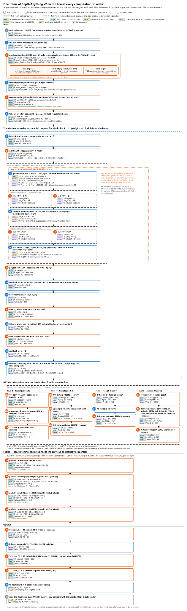
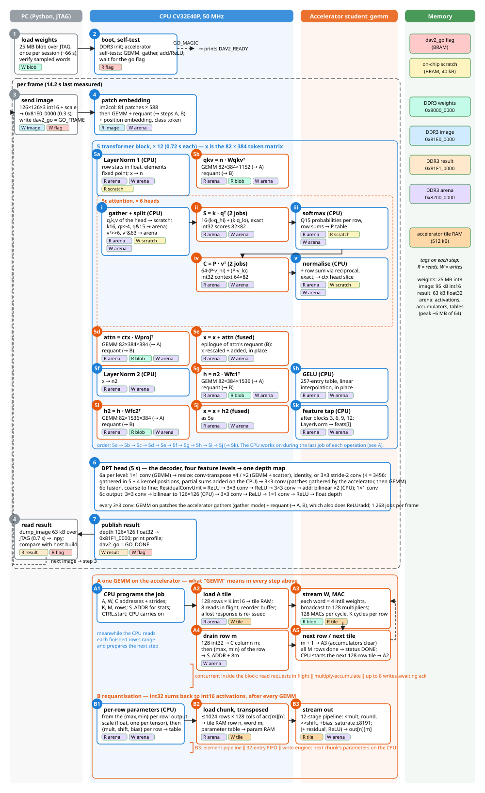

# How data flows

This document is a companion to `ARCHITECTURE.md`. That document shows what
the blocks are. This document shows when things happen. It covers the bus
handshake cycle by cycle, one full inference run, and the cycle sequence of
the hardest bug in the project.

A timing diagram shows signals as horizontal lines. Time runs left to right.
Vertical lines mark clock cycles. A high line means the signal is 1. A low
line means it is 0. To read one, find the cycle where two signals are both
high at the same time.

---

## 1. The TL-UL handshake

One rule governs every transfer on the bus. Data moves only in a cycle
where `valid` and `ready` are both high. The sender raises `valid` and holds
its data steady. The receiver raises `ready` once it can accept the data.
Neither side may assume the other is watching. Once `valid` is high, the
sender must not change or withdraw its data until the transfer happens.

*Cycle 3: the request goes through. Both a_valid and a_ready are high. Cycle
5: the device offers its response, but the receiver is not ready. A
compliant device would keep offering the response. Cycle 6: the response
goes through. The platform's cache does not behave this way. It drops the
response after cycle 5 instead of holding it. This is the "d_ready defect".
The accelerator's retry timer exists to survive it.*

The three fixed bugs each broke this picture in a different way.

- **Request mux (bug 1).** The CPU saw `a_ready` go high from a block that
  was never going to accept the request. Cycle 3 looked like a transfer to
  the CPU. Nothing on the other side recorded it. No response could ever
  arrive.
- **d_ready defect (worked around, not fixed).** The device raises
  `d_valid` for exactly one cycle and never checks whether the receiver is
  ready. If the receiver is busy that one cycle, the response is gone.
- **Write-back (bug 2).** The handshake itself was correct. The data on the
  write-back was one cycle old. A handshake diagram cannot show this bug.
  Section 4 below shows it.

---

## 2. One inference, end to end

This is the wall-clock view of running one frame on the board, at a 50 MHz
clock. The last frame measured on the board took 14.2 seconds, after a
one-time weight load of about 66 seconds. The changes made since then have
not yet been measured on the board (`PERFORMANCE.md` §5).

*The JTAG weight load takes up most of the wall clock. It is a one-time
setup cost, not something every frame pays. Inside the model itself, every
transformer block alternates accelerator jobs (GEMM, requantisation) with
CPU element-wise work. After the speed-up work in PERFORMANCE.md, the two
now take about the same amount of time.*

Terms used above:

- **Patch embedding.** The first layer. It cuts the image into 14x14
  patches and turns each patch into a 384-number vector.
- **Transformer block.** The repeated unit of a vision transformer. It has
  self-attention, where each patch looks at every other patch, followed by
  an MLP, a two-layer network applied to each patch. There are twelve
  blocks, run one after another.
- **qkv / proj / fc1 / fc2.** The four matrix multiplies in one block.
- **DPT head.** The decoder. It turns the transformer's features back into
  a full-resolution depth map.
- **LayerNorm, GELU, softmax.** Element-wise normalisation and activation
  functions. Each one is cheap, but there are millions of elements. They run
  on a scalar CPU that finishes about one instruction per cycle. They now
  run in fixed point, except for the per-row statistics.

---

## 3. The whole computation, step by step

One picture shows every operation of one frame, numbered 1 to 35, in the
order they run. Each box names an operation. It also lists the tensors it
reads (R) and writes (W), with their shapes. The box colour shows where it
runs: blue for the CPU, orange for the accelerator, grey for the PC. A tag
under each box names the memory region it used. See the memory map in
`ARCHITECTURE.md` section 3.

Most of the computation is a straight chain. Each step needs the output of
the step before it. A few parts can run at the same time or in any order,
and the picture marks those with fork and join bars.

- **Solid orange bars** mark work that truly runs at the same time. The
  figure marks one such place: inside every accelerator job. Three engines
  run together there. A read engine keeps up to eight requests in flight.
  128 multiply-accumulate units do the arithmetic. A write engine keeps up
  to eight writes waiting for acknowledgement. This overlap is why the
  block moves one word every 3.2 cycles instead of every 8.3.
- **Dashed grey bars** mark work that does not depend on other work at the
  same stage, so it could run in parallel. Today it still runs one piece
  after another. Examples: the six attention heads, the two half-products
  in each attention GEMM, and the four DPT feature levels.
- The CPU and the accelerator overlap where the work allows it. The last
  job of an operation can be left running while the CPU does work that
  does not need its result. It reads each finished row's range while the
  GEMM drains later rows. It computes the next chunk's requantisation
  parameters while the current chunk converts. In attention, it prepares
  the next head while the current one multiplies. Most steps still need
  the previous result, so most of the frame stays a chain. See
  `PERFORMANCE.md` section 5, round four.

*Steps 7 to 21 repeat for each of the twelve transformer blocks. Steps 9 to
13 repeat for each of the six heads inside a block. "GEMM + requant" always
means the same three-step pattern: the accelerator multiplies two matrices,
the CPU turns the per-row range it reports into scaling parameters, and the
accelerator applies those parameters to produce int16 output.*

### Step by step, in plain words

**Input**

| Step | What happens |
|---|---|
| 1 | The host resizes the photo to 126x126 pixels. It normalises the pixels and converts them to int16. It sends the result to the board over JTAG. |
| 2 | The CPU cuts the image into 81 patches of 14x14 pixels each. This step is called im2col. |

**Patch embedding**

| Step | What happens |
|---|---|
| 3 | GEMM + requant. Each patch becomes a 384-number vector, by multiplying it with the patch-embedding weights. The 81 patches fit in one accelerator tile. |
| 4 | The CPU computes the requantisation table from the ranges the accelerator reported. |
| 5 | The accelerator's requantisation job produces the embedded patches as int16. |
| 6 | The CPU builds the 82-token sequence. It adds a learned class token, then adds a learned position to each of the 81 patches. The result is the matrix that every transformer block updates. |

**Transformer encoder (steps 7 to 21 repeat for each of the 12 blocks)**

| Step | What happens |
|---|---|
| 7 | LayerNorm 1. The CPU computes each token's mean, 1/√variance and range in fixed point. A first requantisation job (int16 input, tokens as rows) computes z = (x − mean)/std at a common 14-bit scale and writes it channel by channel. The CPU finds each channel's range; a second job applies γ and β per channel, scales, saturates and writes the result token by token. |
| 8 | GEMM + requant. The block's qkv weights produce query, key and value vectors for all 6 attention heads at once. |
| 9 to 13 | Attention, repeated for each of the 6 heads. See the table below. Heads do not depend on each other, but run one after another today. |
| 14 | GEMM + requant. The combined attention output is projected back to 384 dimensions. |
| 15 | Residual add. The block's output is added to its input, so information is not lost. This runs inside step 14's requantisation job, on the accelerator, and updates the token matrix in place. |
| 16 | LayerNorm 2, the same idea as step 7. |
| 17 | GEMM + requant + GELU. The MLP's first layer expands the data from 384 to 1536 dimensions. The requantisation job also applies GELU through its lookup table. |
| 18 | GELU. A smooth activation function, applied to each element. The CPU builds a table with one output per possible input (16384 entries, from 257 interpolated points of a fixed Φ table); the accelerator loads it with step 17's first job and applies it to every element. |
| 19 | GEMM + requant. The MLP's second layer compresses the data back to 384 dimensions. |
| 20 | Residual add, the same idea as step 15, inside step 19's requantisation job. The result feeds the next block's step 7. |
| 21 | After blocks 3, 6, 9 and 12 only: a normalised copy of the data is saved as one of the four feature maps the decoder needs. |

*Attention, steps 9 to 13, once per head.* The accelerator can only multiply
int8 by int16. The query, key and value vectors are int16, so each is split
into a high half and a low half, both int8. The multiply then runs twice
and the two results are combined. This gives an exact answer, not an
approximation.

| Step | What happens |
|---|---|
| 9 | The CPU gathers this head's slice of the query vectors (shifted to 11 bits) and the value vectors (transposed), as int16. The key vectors are read by the accelerator in place, in the qkv tensor. |
| 10 | One GEMM with int16 weights computes the attention scores. Its row statistics give each query's largest score. (An older bitstream without int16 weights uses two GEMMs over int8 halves.) |
| 11 | Softmax. The CPU turns each row of scores into probabilities and divides them by the row sum, so that each row sums to 2^15. |
| 12 | One more GEMM with int16 weights combines the probabilities with the value vectors. |
| 13 | A requantisation job rounds the result to the value scale (a shift by 15) and writes it straight into this head's columns of the context tensor. No division is needed, because the probabilities are already divided by their sum. |

**DPT decoder**

Steps 22 to 25 build four feature maps, one per level. Steps 26 to 29 fuse
them together.

The four feature maps from step 21 are at four resolutions, from 9x9 up to
36x36. The decoder combines them starting from the coarsest.

| Step | What happens |
|---|---|
| 22 to 25 | One step per feature level. Each level does not depend on the others, but they run one after another today. A 1x1 convolution reduces the number of channels. A resize brings the result to the level's target resolution. A 3x3 convolution then refines it. For every 3x3 convolution the accelerator gathers the pixel neighbourhoods from the image itself (gather mode), then multiplies and requantises. A 1x1 convolution needs no gathering. |
| 26 to 29 | Strictly sequential, from the coarsest level to the finest. Each step refines the previous level's output with a residual conv unit, two 3x3 convolutions with a ReLU between them, adds the current level's own feature map, upsamples on the CPU, and projects the result with a 1x1 convolution. |

**Output**

| Step | What happens |
|---|---|
| 30 | A 3x3 convolution reduces 64 channels to 32. |
| 31 | Bilinear upsampling on the CPU, from 72x72 to the full 126x126. |
| 32 | Another 3x3 convolution at 32 channels, followed by a ReLU. |
| 33 | A final 1x1 convolution reduces 32 channels to one, the depth channel, followed by a ReLU. |
| 34 | The CPU writes the int16 depth map and its scale (m, sh) to DDR3 and raises the done flag. The PC converts it to float. |
| 35 | The host reads the depth map over JTAG. This takes 0.7 seconds. It saves the map and renders it next to the PyTorch reference. |

One frame runs 1,268 accelerator jobs in total (counted by the accelerator
emulator on the current code). Each weight matrix is read from DDR3 once,
because every activation tile of the encoder fits in one 128-row tile. The
frame uses about 6 MB of the 64 MB scratch arena at peak. The last frame
measured on the board took 14.2 seconds at 50 MHz, before the most recent
changes.

### The same frame as a process

The figure below shows the same frame from a different angle. Section 3's
figure above shows what is computed. This figure shows who does it and
where the data goes. It uses four lanes: PC, CPU, accelerator, and memory.

Steps 1 and 2 happen once per session, at boot and weight load. Steps 3 to 8
repeat once per image. Step 5, one transformer block, and its sub-step 5c,
one attention head, are expanded into their own numbered rows. "GEMM" and
"requant" boxes point to the A and B expansions at the bottom. Those two
expansions apply everywhere a "GEMM" or "requant" box appears above.

| Step | Who | What happens |
|---|---|---|
| 1 | Host | Loads the 25 MB weight blob over JTAG. This happens once per session and takes about 66 seconds. The host checks a few words afterward to confirm the load worked. |
| 2 | CPU | Boots, sets up DDR3, and runs three small accelerator self-tests against the CPU: a GEMM, gather mode, and the add/ReLU epilogue. A failed test switches off only that feature. It also prints a short microbenchmark of the core. Then it waits for the host's go flag. |
| 3 | Host | Sends one image, which takes 0.3 seconds, and raises the "run a frame" flag. |
| 4 | CPU and accelerator | Patch embedding: im2col, then GEMM and requant. The CPU then adds position embeddings and the class token. |
| 5 | CPU and accelerator | One transformer block. Its sub-steps run in this order: LayerNorm, qkv GEMM, six attention heads, projection GEMM, residual add, LayerNorm, MLP up GEMM, GELU, MLP down GEMM, residual add, and, on blocks 3, 6, 9 and 12, the feature tap. Both residual adds run inside the requantisation job of the GEMM before them. While the last job of each operation runs, the CPU carries on with the work that does not need its result. |
| 6 | CPU and accelerator | The DPT head. Four feature levels each get a 1x1 convolution, a resize, and a 3x3 convolution. The levels are then fused from coarsest to finest with residual conv units and 1x1 convolutions. A final chain of 3x3 convolution, upsample, 3x3 convolution and 1x1 convolution produces the depth map. Every 3x3 convolution gathers its patches on the accelerator (gather mode), then multiplies and requantises; the ReLUs after convolutions and the adds in the residual conv units run inside the requantisation job. The whole frame runs 1,268 accelerator jobs. |
| 7 | CPU | Writes the depth map to its DDR3 result slot, prints timing information, and raises the done flag. |
| 8 | Host | Reads the result over JTAG, which takes 0.7 seconds, saves it, and compares it against the host build. Then it loops back to step 3 for the next image. |

**A. One GEMM on the accelerator.** This is what every "GEMM" box above
means.

| Step | What happens |
|---|---|
| A1 | The CPU programs the job's registers: the A, W and C addresses and strides, K, M, the row count, and S_ADDR for statistics. It then sets CTRL.start. For the last job of an operation it may carry on with independent work and collect the job later; otherwise it polls STATUS. |
| A2 | The accelerator loads a 128-row tile of A into on-chip RAM. Up to 8 reads stay in flight, using a reorder buffer. If a response is lost, it is re-issued automatically. |
| A3 | The accelerator streams W one word at a time. Each word carries 4 packed int8 weights. Each weight is broadcast to all 128 multiply-accumulate units. This gives 128 MACs per cycle, and K cycles per weight row. |
| A4 | The accelerator writes that row's 128 int32 sums to column m of C. If statistics are enabled, it then writes that row's maximum and minimum. |
| A5 | The accelerator moves to the next row. Once all M rows are done, it reports STATUS.done. The CPU then starts the next 128-row tile, back at step A2. |

The three parts of step A3, reading, multiplying and writing, run at the
same time inside the block, as described in section 3.

**B. Requantisation.** This is what every "requant" box above means. It
runs right after every GEMM.

| Step | What happens |
|---|---|
| B1 | From each row's maximum and minimum, the CPU computes one output scale for the whole tensor, then a multiplier, shift and bias for each row. |
| B2 | The accelerator reads the int32 result, transposed, into its tile RAM. It reads the parameter table into a small RAM alongside it. |
| B3 | The accelerator streams out the scaled, rounded and saturated int16 result, with two values packed per 32-bit word. |

---

## 4. The write-back bug, cycle by cycle

This was the most expensive bug to find in the project. It is drawn at the
level where the mistake becomes visible. Two writes happen back to back, to
addresses that collide in the cache: they map to the same cache line, but
they are different addresses. The first write misses the cache, is fetched
from DDR3, and lands in the cache's RAM. The very next cycle, the second
write misses the same line. To make room, the cache must evict the first
line, which means writing it back to DDR3.

What happens, cycle by cycle:

1. **Cycle N: write A lands.** A write updates the cache's data RAM. From
   this cycle on, the RAM holds A's new value.
2. **Cycle N+1: write B misses the same line.** B's address maps to the
   same cache slot as A, but is a different address. This is a miss. The
   line must be evicted to make room. Since the line was just written, it
   is dirty, so its contents must go back to DDR3 first.
3. **The eviction reads the wrong copy.** The write-back logic reads the
   line from a signal called `data_rdata_raw`. This signal is the RAM's
   output from before cycle N's write became visible, one cycle too early.
   It sends A's old value to DDR3 instead of A's new value.
4. **A's data is lost.** DDR3 now holds A's old value where it should hold
   A's new value. Nothing else will rewrite it. The loss is silent and
   permanent.
5. **The fix.** A second signal, `data_rdata`, already existed. It is the
   same read, but forwarded so it reflects a same-cycle write. Using this
   signal for the write-back closes the gap.

*Every lost word on the board was a tile's final write. That write is
always followed immediately by the next tile's first access, which misses
the same cache line. This is exactly the two-cycle pattern above.*

This is why the bug was hard to find:

- The accelerator's own counters showed that every write was issued and
  acknowledged, and this was true. The cache acknowledges a write as soon as
  it lands in the cache, before the write-back happens. The acknowledgement
  was correct. The write-back was wrong.
- The bug needs two misses to the same line on consecutive cycles. A
  testbench driver that waits for each response before sending the next
  request cannot produce this pattern. The bug only appeared once the
  driver was rewritten to send its next request the moment the previous one
  was accepted, the way the accelerator actually behaves.
- Reading the word back after the cache had evicted it showed that the loss
  was permanent. This ruled out a briefly stale read, and pointed to the
  write-back path instead.

---

## 5. How a stalled bus was diagnosed without halting the CPU

This section is not a timing diagram. It shows data flow, because the
mechanism is the point. When the CPU is stuck on a bus access it can never
finish, the debugger cannot halt it. The usual method, reading the program
counter, does not work. A hardware register that watches the bus solved
this.

*The CPU's stalled access blocks the CPU, not the bus. The debug module's
own bus port still works. A register that watches the DDR3 port can be read
out. It reports which request never came back: from which master, to which
address, and for how long.*

This diagnostic broke the longest impasse in the project. The register
(`student_tl_watch.sv`, exposed at `DDR_CTRL0 + 0x4/0x8`) reported, in a
single line, an accelerator write, thirty transactions outstanding on the
port, and a saturated stall counter. This was enough to go straight to the
request mux and find bug 1.
