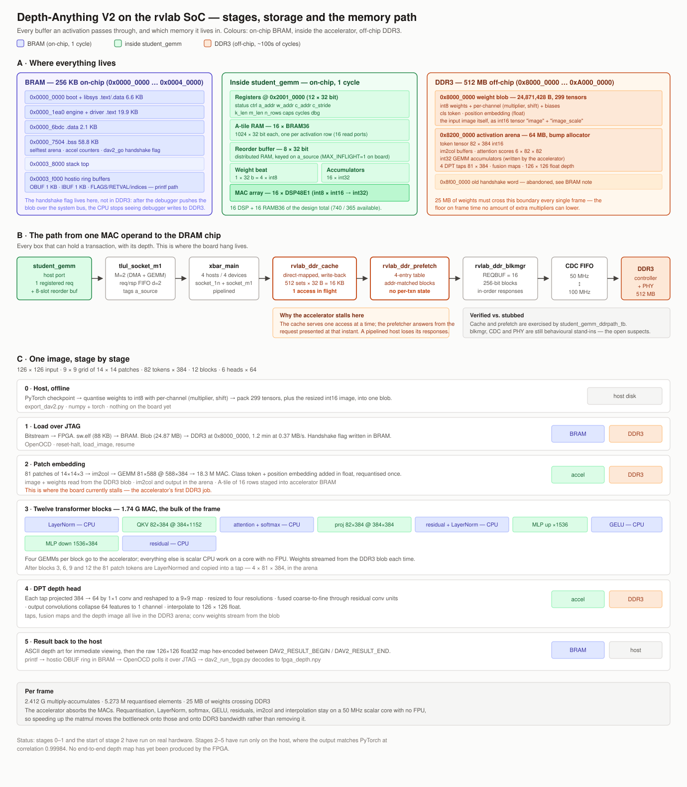

# Running one image through the model on the FPGA

Every stage a picture passes through, from a JPEG on your laptop to a depth
map printed by the board. Shapes are for the 126x126 configuration
(`DAV2_INPUT_SIZE 126`), which gives a 9x9 grid of 14x14 patches.

Model constants: embed dim **384**, **6** heads of **64**, **12** transformer
blocks, DPT features **64**, activations int16 at 14 bits (+-8191), weights
int8 (+-127), q/k inside attention 11 bits (+-2047).

---

The diagram above shows all three views at once: **A** where every buffer
lives (BRAM, inside the accelerator, DDR3), **B** every module that can hold a
transaction between a MAC operand and the DRAM chip — socket, crossbar, cache,
prefetcher, block manager, CDC FIFO — with its depth, and **C** the stages
below, colour-coded by which memory each step touches.

---

## Stage 0 — On the host, before anything reaches the board

**Weights, once per model.** `tools/export_dav2.py` reads the PyTorch
checkpoint and writes a flat blob: every linear and conv weight quantised to
int8 with a per-output-channel scale, each scale pre-converted to an integer
`(multiplier, shift)` pair, biases pre-scaled into accumulator units. 299
tensors, **24,871,428 bytes**.

**The image.** Resized to 126x126, normalised, quantised to int16, and packed
into that same blob as the tensor `image` with its scale in `image_scale`. So
the picture travels to the board the same way the weights do -- there is no
camera input, and the board never sees a JPEG.

## Stage 1 — Getting it into the board

1. `flow rvlab_fpga_top program` loads the bitstream. The CV32E40P, the GEMM
   accelerator and the DDR3 controller come to life.
2. OpenOCD reset-halts the core and loads `sw.elf` (~88 KB) into BRAM.
3. The program boots, runs its kernel self-test and the accelerator's
   hardware-vs-software check, brings up DDR3, then prints
   `DAV2_WAITING_FOR_WEIGHTS` and spins on a flag.
4. The host pushes the 24.87 MB blob into DDR3 at `0x80000000` over JTAG --
   **~1.2 minutes at 0.37 MB/s** -- verifies the header, then writes the flag.

The flag lives in **BRAM**, not DDR3: once the debugger has pushed the blob
through system bus access, the CPU stops observing debugger writes to DDR3.

## Stage 2 — Patch embedding

The 126x126x3 image is cut into **81 patches** of 14x14x3. Each patch is
flattened to 588 numbers and multiplied by the patch-embedding matrix to give
384 features.

    GEMM:  81 x 588  @  588 x 384   ->  81 x 384      (18.3 M MAC)

A learned **class token** is prepended and a position embedding added, giving
**82 tokens x 384**. That step is done in float and requantised once, because
the class token and position embedding are stored as floats in the blob.

## Stage 3 — Twelve transformer blocks

Each block, on 82 tokens x 384:

| Step | Shape | Where |
|---|---|---|
| LayerNorm | 82 x 384 | CPU |
| QKV projection | 82x384 @ 384x1152 | **accelerator** |
| Attention: Q·K^T, softmax, ·V | 6 heads x 82x82 | CPU |
| Output projection | 82x384 @ 384x384 | **accelerator** |
| Residual add | 82 x 384 | CPU |
| LayerNorm | 82 x 384 | CPU |
| MLP up + GELU | 82x384 @ 384x1536 | **accelerator** + CPU |
| MLP down | 82x1536 @ 1536x384 | **accelerator** |
| Residual add | 82 x 384 | CPU |

Roughly **145 M MAC per block**, so **1.74 G MAC** for the twelve -- the bulk
of the frame.

After blocks 3, 6, 9 and 12 the token tensor is LayerNormed and the 81 patch
tokens (the class token is dropped) are copied into one of four **taps**, each
81 x 384. These are what the depth head reads.

## Stage 4 — DPT head

1. **Projections.** Each tap is projected from 384 down to 64 features by a
   1x1 convolution, and reshaped from 81 tokens into a 9x9 spatial map.
2. **Resize.** The four maps are brought to different resolutions -- the
   shallow tap upsampled most, the deep tap least -- so they can be fused
   coarse-to-fine.
3. **Fusion.** Starting from the deepest, each level is upsampled and added to
   the next, passing through residual convolution units.
4. **Output convolutions.** A final pair of convolutions collapses 64 features
   to a single channel.
5. **Interpolate** to the full **126 x 126** output.

## Stage 5 — Getting the answer back

The board prints the depth map twice: as coarse **ASCII art** so you can see it
immediately over the hostio link, and as a **hex dump** between
`DAV2_RESULT_BEGIN` / `DAV2_RESULT_END`, which `dav2_run_fpga.py` decodes into
`fpga_depth.npy` -- 126x126 float32.

---

## Where the work actually goes

| | Per frame |
|---|---|
| Multiply-accumulates | **2.412 G** |
| Requantised elements | **5.273 M** |
| Weights crossing DDR3 | **25 MB** |

The accelerator handles the MACs. Everything else -- requantisation,
LayerNorm, softmax, GELU, residual adds, im2col, interpolation -- stays on a
50 MHz scalar core with no FPU, and 25 MB of weights must cross DDR3 every
frame regardless. Speeding up the matmul moves the bottleneck onto those.

## Status

Stages 0, 1 and the start of stage 2 have been executed on real hardware.
Stages 2-5 have been executed **only on the host**, where the output matches
the PyTorch reference with correlation **0.99984**.

No end-to-end depth map has been produced by the FPGA: the accelerator stalls
partway through stage 2 against DDR3 (see `report_errors.md`), and the
software fallback path would need roughly a day per frame at the DDR3 access
latency measured on the board.
